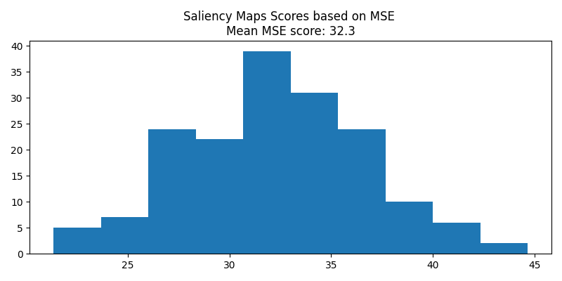

# Saliency Maps

The saliency maps are generated using edge splatting technique. In splatting multiple textures with different alpha maps over a mesh. In our project we augmented the method devised by Krueger et al [1].

- In the first step, a gaussian kernel of fixed standard deviation (10% of max-pixel width) and saccades amplitude as max gaussian value is applied to all the fixation points. The values at the overlapping pixels are added.

- In the second step the density values are mapped to a color gradient.

## Code

We use git gist to save the script for the saliency maps. Our python script to generate and compare saliency maps can be found at [git gists](https://gist.github.com/ssaket/e431b2d5b7aad65ec1b49ae49652cc86)

## Scores (Performance Metrics)

- *Mean Squared Error (MSE)*

<!-- $MSE=\frac{1}{mn}\sum_{i=0}^{m-1}\sum_{j=0}^{n-1}[I(i,j) - K(i, j)]^2$ -->

where, (i, j) are dimentions of image I and K

MSE score distribution for all 170 pic_IDs

## References

[1] Krueger, Robert & Koch, Steffen & Ertl, Thomas. (2016). SaccadeLenses: Interactive Exploratory Fltering of Eye Tracking Trajectories. 31-34. 10.1109/ETVIS.2016.7851162.
